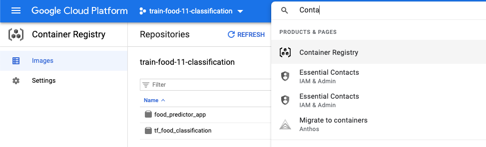

# Deployement of your image recognition model

This github repository aim to give a fully adaptable way to deploy easily an 
image classification model using GCP. It will provide if configured to do so 
both access to an API and a web app allowing to uload an image and receive the
model predictions.

The web app is built using Flask and deployed in a GCP 
[Cloud Run](https://cloud.google.com/run) environement.

## Prerequest

In order to use this module you will need a GCP account. 
You will need to install Google Cloud SDK in order to use the command `gcloud`.
In order to install it, use the following [link](https://cloud.google.com/sdk/docs/install)

## Set up the virtual env

Set up the local virtual env in order to do some local testing.

- Build your virtual environement.
`virtualenv venv`

- Activate your local environement.
`source venv/bin/activate`

- Install all the necessary python package indicated in the `requirements.txt` file.
`pip install -r requirements.txt`

## Run flask localy (NOT FOR PRODUCTION)

You can simply test your application localy running the Flask app with the
following command.

`python predictor.py`

## Run flask with gunicorn local (For pre-production testing)

As the first methode is only good for developpement, giving the errors, we do 
not recommande to use it in production and pre-production.
For pre-production testing use the following commande.

`gunicorn -b 0.0.0.0:8080 predictor:app`

## Deployement on GCP

In order to deploy your application on GCP Cloud Run you need to use the 
following commands.

- Verify that you are in the right project.
`gcloud config get-value project`

- Set the project ID to build your image URI.
`export PROJECT_ID=train-food-11-classification`

- Set your docker image URI.
`export IMAGE_URI=eu.gcr.io/$PROJECT_ID/food_predictor_app`

- Build your docker image and make it available in Container Registery.
`gcloud builds submit --tag $IMAGE_URI`
 /!\ it uses the gitignore

You should then be able to see it in the Container Registery app.

- Deploy your model 
`gcloud run deploy --image $IMAGE_URI --platform managed`

gcloud run deploy --image $IMAGE_URI --platform managed --memory 2.0G

For more details, we recomand 
go in cloud run GCP service to see your running app

annex: 

TODO :

Allow unauthenticated invocations to [foodpredictorapp] (y/N)? -> How to set to No